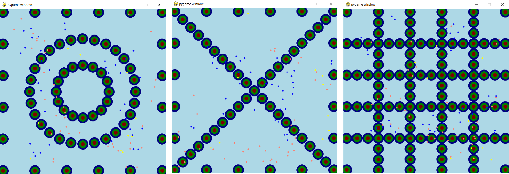
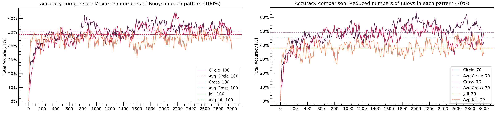

# MBSE - Smart Efficient Sustainable - Fishing Navigation System
This project has been developed for the Model-Based Systems Engineering course taken from September to December 2022. 

The problem that this project tries to develop is overfishing, so a simulator has been developed consisting of an intelligent, efficient and sustainable fishing navigation system that:
- Detects fish of different species
- Determine whether an endangered species is present in the fishing area
- Provide fishermen with an interactive panel to provide guidance on where to fish for non-endangered species.

## Table of contents
* [Project Overview](#project_overview)
* [Technologies](#technologies)
* [Setup](#setup)
* [Launch](#launch)

<a name="project_overview"></a>
## Project Overview

Several systems have been established for this purpose. The first is the Environmental System, which defines the space over which the fish will move and the movement and parameters that define them.
The following system is the detection of the fish, for which buoys have been simulated; these have a sonar and a camera to detect which zone the fish is in. These buoys can be set in three patterns, as shown in the following images.
Finally, this information is stored and processed by PowerBi, so that this would be the information obtained by the Fisherman, knowing in which areas there are more fish.



<a name="technologies"></a>
## Technologies

The entire system environment, the bouys system and the analysis have been developed using Python 3.10.7. For the fisherman dashboard, PowerBi has been used. In addition, the following libraries have been used: 
- [Pymunk](http://www.pymunk.org/en/latest/): a library to compute 2D collision and used for the definition of the lake and to update the fish movement.
- [Pygame](https://www.pygame.org/news): a library to visualise the whole environment and the bouys system in real time.
- [Numpy](https://numpy.org/): a library to facilitate mathematical calculations.
- [Pandas](https://pandas.pydata.org/): a library for creating and maintaining databases, mainly used to perform the analysis part.


<a name="setup"></a>
## Setup
To run this project correctly, Python 3.10.7 (other versions cannot be guaranteed to work correctly) and PowerBi must be installed. For the installation of Python there is documentation that can be easily found on the web. As for the installation of PowerBi, it is recommended to install it from [the official website](https://powerbi.microsoft.com/en-gb/downloads/).
As for the libraries, it is strongly recommended that they are installed using the pip command, otherwise the latest version of pygame will not be found, and compatibility problems may arise between the library and Python. These commands can be found below:

```
pip install pymunk
```
```
pip install pygame
```
```
pip install numpy
```
```
pip install pandas 
```
<a name="launch"></a>
## Launch
Before running the main.py, the buoys system pattern can be decided on.
For changing the buoys system, the variable type_pattern in [variables_and_functions.py] in line 206 can be changed. 
The following can be entered: 1 = Circle Pattern, 2 = Cross Pattern, 3 = Chessboard Pattern. Currently, the variable type_pattern is set to 2 which means that the Cross Pattern is the buoys pattern for which the simualtion model will be executed.

Running the [main.py](main.py) file, you will be able to visualise a simulation of the system and, at the end, it will generate three CSV files. One with the delta, which ..., another with relative delta which ... and finally one that stores data of interest for statistics, that can be analyzed by running [analys.py](analys.py), getting images like this: 



To modify parameters of the simulation you can do it at the end of the [variables_and_function.py](variables_and_function.py) file, being able to change the size of the window, the number of fish or the pattern to be used.

In the [environment_classes.py](environment_classes.py) file, you can modify the behaviour of the fish by varying the radius of attraction, orientation and repulsion. Varying these parameters can lead to undesired behaviour.

Finally, by opening the [mbse_dashboard_2](dashboard/mbse_dashboard_2.pbix) PowerBi file and loading the relative delta CSV file, that the code generates, into it we can visualise the areas where the highest number of fish has been predicted. Also, you can see an example of the PowerBi [here](https://app.powerbi.com/groups/me/reports/8294714a-6178-49e4-879f-d6f889ebc8d8/ReportSection99a53b72b52c393fa9da?ctid=f251f123-c9ce-448e-9277-34bb285911d9) opening the link signing up with your DTU account.


